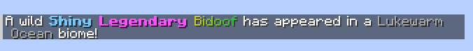

# Examples
### Legacy versions
:::warning
These examples are written for CSA 1.12.0+ using [ETA markup](https://tysontheember.dev/embers-text-api/for-modpack-creators/markup-guide/).  
For older versions, the markup in these examples will not work. See the [MiniMessage](https://docs.papermc.io/adventure/minimessage/) docs.
:::

### Change the shiny color
:::info Example
`"shiny": "<bold><color value=#78CBFF>Shiny </color></bold>",`
:::

### Change the full spawn message
:::info Example
`"fullSpawnMessage": "<c value=#FFFFFF>A wild {shiny}{legendary}<rainbow>{name}</rainbow> has appeared{biome}!",` 
`"shiny": "<bold><color value=#78CBFF>Shiny </color></bold>",`
:::
