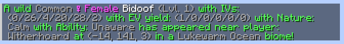
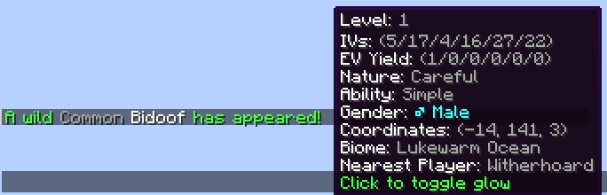
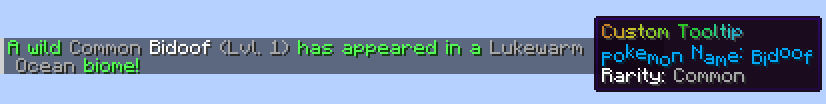

# Examples
### Legacy versions
:::warning
These examples are written for CSA 1.12.0+ using [ETA markup](https://tysontheember.dev/embers-text-api/for-modpack-creators/markup-guide/). <br />
For older versions, the markup in these examples will not work. See the [MiniMessage](https://docs.papermc.io/adventure/minimessage/) docs.
:::

### Adding your own configs
To get started with adding your own configs, copy the default **config object** -- **not** the entire contents of the file. <br />
Then, next to the third bracket from the bottom of the file, make sure to add a comma. Add a new line and paste it there. <br />
Finally, replace the placeholder text with your Pokemon names.

<details>
<summary>Example: Charmander line</summary>

```json
{
  "configVersion": "1.12.2",
  "comment": [
    "This config is only on your client. It determines which Pokemon are alerted, and how that alert is displayed.",
    "For documentation on using the config, please see the Modrinth or GitHub for the mod.",
    "https://modrinth.com/mod/cobblemon-spawn-alerts",
    "https://github.com/StainlessStasis/CobblemonSpawnAlerts"
  ],
  "pokemonConfigs": {
    "default (You can modify anything BELOW this, but dont delete it!)": {
      "enabled": true,
      "alwaysAlert": true,
      "alertShiny": true,
      "alertHiddenAbility": true,
      "alertDespawned": true,
      "showLegendary": true,
      "showBucket": true,
      "statDisplayModes": {
        "level": "MAIN_MESSAGE",
        "ivs": "DISABLED",
        "evs": "DISABLED",
        "nature": "DISABLED",
        "ability": "DISABLED",
        "gender": "HOVER",
        "coordinates": "HOVER",
        "biome": "MAIN_MESSAGE",
        "nearestPlayer": "DISABLED"
      },
      "customAlertMessage": "",
      "customAlertTooltip": "",
      "customAlertClickEvent": "",
      "sounds": {
        "shiny": "",
        "legendary": "",
        "mythical": "",
        "ultrabeast": "",
        "paradox": "",
        "starter": "",
        "bucket": "",
        "unregistered": "",
        "uncaught": "",
        "ivs": "",
        "evs": "",
        "despawned": ""
      },
      "customAlertSound": "",
      "autoGlow": false,
      "glowColor": "#FFFFFFFF",
      "journeyMap": {
        "enableWaypoint": false,
        "waypointName": "",
        "waypointHexColor": "",
        "persistent": false
      }
    }, 
    "charmander, charmeleon, charizard": {
      "enabled": true,
      "alwaysAlert": true,
      "alertShiny": true,
      "alertHiddenAbility": true,
      "alertDespawned": true,
      "showLegendary": true,
      "showBucket": true,
      "statDisplayModes": {
        "level": "MAIN_MESSAGE",
        "ivs": "DISABLED",
        "evs": "DISABLED",
        "nature": "DISABLED",
        "ability": "DISABLED",
        "gender": "HOVER",
        "coordinates": "HOVER",
        "biome": "MAIN_MESSAGE",
        "nearestPlayer": "DISABLED"
      },
      "customAlertMessage": "",
      "customAlertTooltip": "",
      "customAlertClickEvent": "",
      "sounds": {
        "shiny": "",
        "legendary": "",
        "mythical": "",
        "ultrabeast": "",
        "paradox": "",
        "starter": "",
        "bucket": "",
        "unregistered": "",
        "uncaught": "",
        "ivs": "",
        "evs": "",
        "despawned": ""
      },
      "customAlertSound": "",
      "autoGlow": false,
      "glowColor": "#FFFFFFFF",
      "journeyMap": {
        "enableWaypoint": false,
        "waypointName": "",
        "waypointHexColor": "",
        "persistent": false
      }
    }
  }
}
```
</details>

### Show all stats in main message
<details>
<summary>Example</summary>

```json
"bidoof": {
  "enabled": true,
  "alwaysAlert": true,
  "alertShiny": true,
  "alertHiddenAbility": true,
  "alertDespawned": true,
  "showLegendary": true,
  "showBucket": true,
  "statDisplayModes": {
    "level": "MAIN_MESSAGE",
    "ivs": "MAIN_MESSAGE",
    "evs": "MAIN_MESSAGE",
    "nature": "MAIN_MESSAGE",
    "ability": "MAIN_MESSAGE",
    "gender": "MAIN_MESSAGE",
    "coordinates": "MAIN_MESSAGE",
    "biome": "MAIN_MESSAGE",
    "nearestPlayer": "MAIN_MESSAGE"
  },
  "customAlertMessage": "",
  "customAlertTooltip": "",
  "customAlertClickEvent": "",
  "sounds": {
    "shiny": "",
    "legendary": "",
    "mythical": "",
    "ultrabeast": "",
    "paradox": "",
    "starter": "",
    "bucket": "",
    "unregistered": "",
    "uncaught": "",
    "ivs": "",
    "evs": "",
    "despawned": ""
  },
  "customAlertSound": "",
  "autoGlow": false,
  "glowColor": "#FFFFFFFF",
  "journeyMap": {
    "enableWaypoint": false,
    "waypointName": "",
    "waypointHexColor": "",
    "persistent": false
  }
}
```
</details>


### Show all stats as hover
<details>
<summary>Example</summary>

```json
"bidoof": {
  "enabled": true,
  "alwaysAlert": true,
  "alertShiny": true,
  "alertHiddenAbility": true,
  "alertDespawned": true,
  "showLegendary": true,
  "showBucket": true,
  "statDisplayModes": {
    "level": "HOVER",
    "ivs": "HOVER",
    "evs": "HOVER",
    "nature": "HOVER",
    "ability": "HOVER",
    "gender": "HOVER",
    "coordinates": "HOVER",
    "biome": "HOVER",
    "nearestPlayer": "HOVER"
  },
  "customAlertMessage": "",
  "customAlertTooltip": "",
  "customAlertClickEvent": "",
  "sounds": {
    "shiny": "",
    "legendary": "",
    "mythical": "",
    "ultrabeast": "",
    "paradox": "",
    "starter": "",
    "bucket": "",
    "unregistered": "",
    "uncaught": "",
    "ivs": "",
    "evs": "",
    "despawned": ""
  },
  "customAlertSound": "",
  "autoGlow": false,
  "glowColor": "#FFFFFFFF",
  "journeyMap": {
    "enableWaypoint": false,
    "waypointName": "",
    "waypointHexColor": "",
    "persistent": false
  }
}
```
</details>


### Custom tooltips and click events
<details>
<summary>Example</summary>

```json
"bidoof": {
  "enabled": true,
  "alwaysAlert": true,
  "alertShiny": true,
  "alertHiddenAbility": true,
  "alertDespawned": true,
  "showLegendary": true,
  "showBucket": true,
  "statDisplayModes": {
    "level": "MAIN_MESSAGE",
    "ivs": "DISABLED",
    "evs": "DISABLED",
    "nature": "DISABLED",
    "ability": "DISABLED",
    "gender": "HOVER",
    "coordinates": "HOVER",
    "biome": "MAIN_MESSAGE",
    "nearestPlayer": "DISABLED"
  },
  "customAlertMessage": "",
  "customAlertTooltip": "<rainbow>Custom Tooltip</rainbow>\n<wave><c value=#00AAFF>Pokemon Name: {name}</c></wave>\n<legendary>Rarity:</legendary> {bucket}",
  "customAlertClickEvent": "run_command:/csa openconfig",
  "sounds": {
    "shiny": "",
    "legendary": "",
    "mythical": "",
    "ultrabeast": "",
    "paradox": "",
    "starter": "",
    "bucket": "",
    "unregistered": "",
    "uncaught": "",
    "ivs": "",
    "evs": "",
    "despawned": ""
  },
  "customAlertSound": "",
  "autoGlow": false,
  "glowColor": "#FFFFFFFF",
  "journeyMap": {
    "enableWaypoint": false,
    "waypointName": "",
    "waypointHexColor": "",
    "persistent": false
  }
}
```
</details>
