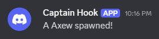
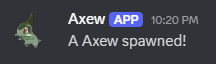
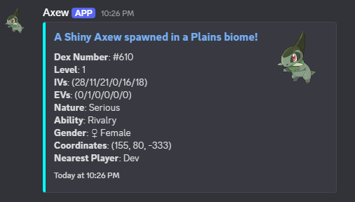
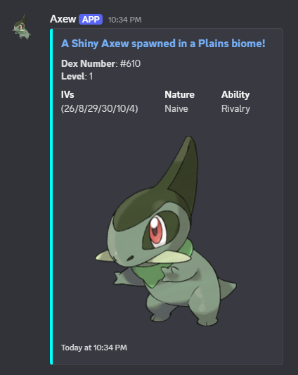

# Examples
### Legacy versions
:::warning
**Always** use the `unformatted` versions of [dynamic replacements](../../customization/content/dynamic_replacements.md) when available!
:::

### Basic webhook
<details>
<summary>Example</summary>

```json
{
  "configVersion": "1.13.1",
  "comment": [
    "This config is common between server and client. It creates Discord webhooks for alerts.",
    "Servers only reference this config for global alerts. Clients use this for every alert, if webhooks are enabled for the alert.",
    "For details on using the config, please see the docs.",
    "https://stainlessstasis.github.io/CSA-Docs/config/"
  ],
  "webhookURL": "YOUR URL HERE",
  "webhookContent": {
    "content": "A {name} spawned!",
    "username": "",
    "avatarURL": "",
    "tts": false,
    "embeds": [
      {
        "enabled": false,
        "title": "**",
        "description": "",
        "color": "",
        "url": "",
        "imageURL": "",
        "thumbnailURL": "",
        "timestamp": true,
        "author": {
          "name": "",
          "url": "",
          "iconURL": ""
        },
        "fields": [
          {
            "name": "",
            "value": "",
            "inline": true
          }
        ],
        "footer": {
          "text": "",
          "iconURL": ""
        }
      }
    ]
  }
}
```
</details>


### Adding a username and avatar
We use `{dex_unformatted}` here to insert the dex number into the image URL and fetch the image for that Pokemon.
<details>
<summary>Example</summary>

```json
{
  "configVersion": "1.13.1",
  "comment": [
    "This config is common between server and client. It creates Discord webhooks for alerts.",
    "Servers only reference this config for global alerts. Clients use this for every alert, if webhooks are enabled for the alert.",
    "For details on using the config, please see the docs.",
    "https://stainlessstasis.github.io/CSA-Docs/config/"
  ],
  "webhookURL": "YOUR URL HERE",
  "webhookContent": {
    "content": "A {name} spawned!",
    "username": "{name}",
    "avatarURL": "https://raw.githubusercontent.com/PokeAPI/sprites/master/sprites/pokemon/other/official-artwork/{dex_unformatted}.png",
    "tts": false,
    "embeds": [
      {
        "enabled": false,
        "title": "**",
        "description": "",
        "color": "",
        "url": "",
        "imageURL": "",
        "thumbnailURL": "",
        "timestamp": true,
        "author": {
          "name": "",
          "url": "",
          "iconURL": ""
        },
        "fields": [
          {
            "name": "",
            "value": "",
            "inline": true
          }
        ],
        "footer": {
          "text": "",
          "iconURL": ""
        }
      }
    ]
  }
}
```
</details>


### Embeds
We use every [dynamic replacement](../../customization/content/dynamic_replacements.md) available to display all the information possible about the Pokemon.
Then, we set a color in **decimal** format. Finally, we link to its Bulbapedia page in the title and insert a thumbnail using `{dex_unformatted}`.

:::warning
The Bulbapedia link may not work for some Pokemon with spaces in their names if your webhook is sent from the server.
Also, it might only work with English. I'm not sure.
:::
<details>
<summary>Example</summary>

```json
{
  "configVersion": "1.13.1",
  "comment": [
    "This config is common between server and client. It creates Discord webhooks for alerts.",
    "Servers only reference this config for global alerts. Clients use this for every alert, if webhooks are enabled for the alert.",
    "For details on using the config, please see the docs.",
    "https://stainlessstasis.github.io/CSA-Docs/config/"
  ],
  "webhookURL": "YOUR URL HERE",
  "webhookContent": {
    "content": "",
    "username": "{name}",
    "avatarURL": "https://raw.githubusercontent.com/PokeAPI/sprites/master/sprites/pokemon/other/official-artwork/{dex_unformatted}.png",
    "tts": false,
    "embeds": [
      {
        "enabled": true,
        "title": "**A {shiny_unformatted}{legendary_unformatted}{HA_unformatted}{bucket_unformatted}{name} spawned in a {biome_unformatted} biome!**",
        "description": "**Dex Number**: #{dex_unformatted}\n**Level**: {level_unformatted}\n**IVs**: {ivs_unformatted}\n**EVs**: {evs_unformatted}\n**Nature**: {nature_unformatted}\n**Ability**: {ability_unformatted}\n**Gender**: {gender_unformatted}\n**Coordinates**: {coords_unformatted}\n**Nearest Player**: {nearest_player_unformatted}",
        "color": "65535",
        "url": "https://bulbapedia.bulbagarden.net/wiki/{name}_(Pok%C3%A9mon)",
        "imageURL": "",
        "thumbnailURL": "https://raw.githubusercontent.com/PokeAPI/sprites/master/sprites/pokemon/other/official-artwork/{dex_unformatted}.png",
        "timestamp": true,
        "author": {
          "name": "",
          "url": "",
          "iconURL": ""
        },
        "fields": [
          {
            "name": "",
            "value": "",
            "inline": true
          }
        ],
        "footer": {
          "text": "",
          "iconURL": ""
        }
      }
    ]
  }
}
```
</details>


### Embed fields
We move the thumbnailURL from before to the imageURL to make the image the main focus. Then, we format the most important information using inline fields.
This lists them in a table format instead of putting each field on its own line.
<details>
<summary>Example</summary>

```json
{
  "configVersion": "1.13.1",
  "comment": [
    "This config is common between server and client. It creates Discord webhooks for alerts.",
    "Servers only reference this config for global alerts. Clients use this for every alert, if webhooks are enabled for the alert.",
    "For details on using the config, please see the docs.",
    "https://stainlessstasis.github.io/CSA-Docs/config/"
  ],
  "webhookURL": "YOUR URL HERE",
  "webhookContent": {
    "content": "",
    "username": "{name}",
    "avatarURL": "https://raw.githubusercontent.com/PokeAPI/sprites/master/sprites/pokemon/other/official-artwork/{dex_unformatted}.png",
    "tts": false,
    "embeds": [
      {
        "enabled": true,
        "title": "**A {shiny_unformatted}{legendary_unformatted}{HA_unformatted}{bucket_unformatted}{name} spawned in a {biome_unformatted} biome!**",
        "description": "**Dex Number**: #{dex_unformatted}\n**Level**: {level_unformatted}",
        "color": "65535",
        "url": "https://bulbapedia.bulbagarden.net/wiki/{name}_(Pok%C3%A9mon)",
        "imageURL": "https://raw.githubusercontent.com/PokeAPI/sprites/master/sprites/pokemon/other/official-artwork/{dex_unformatted}.png",
        "thumbnailURL": "",
        "timestamp": true,
        "author": {
          "name": "",
          "url": "",
          "iconURL": ""
        },
        "fields": [
          {
            "name": "IVs",
            "value": "{ivs_unformatted}",
            "inline": true
          },
          {
            "name": "Nature",
            "value": "{nature_unformatted}",
            "inline": true
          },
          {
            "name": "Ability",
            "value": "{ability_unformatted}",
            "inline": true
          }
        ],
        "footer": {
          "text": "",
          "iconURL": ""
        }
      }
    ]
  }
}
```
</details>
